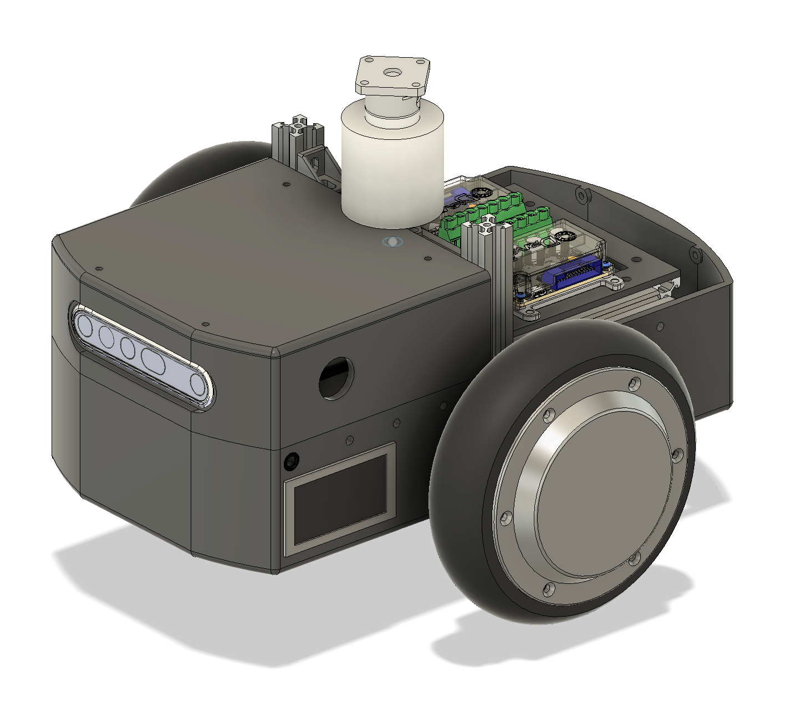

# towing_robot v2

  *towing_robot 2wd  - weight: 10.34kg
  *Towing Robot CAD model* 

## Description

* this page describes all the components that are required to build the Towing Robot

  *Towing Robot 2WD - front view

  *Towing Robot 2WD - back view

 *Towing Robot 2WD - side view* 

## Dimensions

 *Towing Robot Dimensons* 

## Gripper Modules
 *Gripper Modules - up down and front back* 

* the legs of the Biped Robot are described here: [Biped Leg 3dof v1 Documentation](../biped_leg_3dof_v1/README.md#biped-leg-3dof-v1)
* the internal components of the actuator modules are described here:
  * [Actuator Module Core v1.1](../actuator_module_v1/actuator_module_v1.1.md#brushless-actuator-module-core-v11)
* the preparation of the actuator modules is described here: 
  * [Step by Step Instructions](../#step-by-step-instructions)

## Body Module
 *Biped Body Structure Assembled - weight: 99g* 

* the [3d printed parts](#3d-printed-parts) of the body module are listed below
* the [preparation of the 3d printed parts](#preparing-the-3d-printed-parts) is described below

## Electronics

    *Electronic Component Overview* 

   *Electronic Components Biped Robot* 

### Master Board
   *Master Board v2 - weight: 19g each* 
* Custom electronics board: [Master Board Documentation](https://github.com/open-dynamic-robot-initiative/master-board#master-board)

### Micro Driver Boards
   *Micro Driver Boards v2 - stack with 3 cards - weight: 47g* 

* Custom electronics board: [Micro Driver Board Documentation](../../electronics/micro_driver_electronics/README.md#micro-driver-electronics)

## 3D Printed Parts

 *Parts Body Structure - weight: 87g*

  

`The recommended printing direction for all the parts below is the positive z direction of the stl files.`

All the STL files for 3d printing the body structure can be found here: [STL Files Biped Body Structure](stl_files).  

The preparation of the 3d printed parts is described below: [Preparing the 3D Printed Parts](#preparing-the-3d-printed-parts)

More information about 3d printing can be found here: [Details 3D Printed Parts](../actuator_module_v1/details/details_3d_printed_parts.md#details-3d-printed-parts)

---
  
* [Body Structure Front - STL file](stl_files/body_structure_f.STL) 
* weight: 19g
---
  
* [Body Structure Back Rev A- STL file](stl_files/body_structure_b.STL) 
* weight: 14g
---

## Bill of Materials - Biped Robot 6dof
 

| Description | Quantity | Ordering Information | Comments |  
| --- | --- | --- | --- |   
|Biped Leg 3DOF Right Side|1|[Biped Leg 3DOF Documentation](../biped_leg_3dof_v1/README.md#biped-leg-3dof-v1)|Custom assembly|
|Biped Leg 3DOF Left Side|1|[Biped Leg 3DOF Documentation](../biped_leg_3dof_v1/README.md#biped-leg-3dof-v1)|Custom assembly|
| Master Board v2 | 1 | [Master Board Documentation](https://github.com/open-dynamic-robot-initiative/master-board#master-board) | Custom electronics |
| Micro Driver Board v2 | 3 | [Micro Driver Documentation](../../electronics/micro_driver_electronics/README.md#micro-driver-electronics)  | Custom electronics |
|Inertia Measurement Unit| 1 |[Lord Microstrain 3DM-CX5-25](https://www.microstrain.com/inertial/3dm-cx5-25)   [Distributors](https://www.microstrain.com/support/distributors)| Extended measurement range:  Gyro Rate: +/- 900 deg/sec. Accelerometer range: +/- 20G|
|Body Structure Front |1|[STL file](stl_files/body_structure_biped_front.STL)|[3d printed part](../actuator_module_v1/details/details_3d_printed_parts.md#details-3d-printed-parts)|
|Body Structure Back Rev A|1|[STL file](stl_files/body_structure_biped_back_rev_a.STL)|[3d printed part](../actuator_module_v1/details/details_3d_printed_parts.md#details-3d-printed-parts)|
|Body Structure Right Side |1|[STL file](stl_files/body_structure_biped_right_side.STL)|[3d printed part](../actuator_module_v1/details/details_3d_printed_parts.md#details-3d-printed-parts)|
|Body Structure Left Side |1|[STL file](stl_files/body_structure_biped_left_side.STL)|[3d printed part](../actuator_module_v1/details/details_3d_printed_parts.md#details-3d-printed-parts)|
|Body Structure Bottom |1|[STL file](stl_files/body_structure_biped_bottom.STL)|[3d printed part](../actuator_module_v1/details/details_3d_printed_parts.md#details-3d-printed-parts)|
|Body Structure Top |1|[STL file](stl_files/body_structure_biped_top.STL)|[3d printed part](../actuator_module_v1/details/details_3d_printed_parts.md#details-3d-printed-parts) Alternatives below|
|Body Structure Top Vicon |1|[STL file](stl_files/body_structure_biped_top_vicon.STL)|[3d printed part](../actuator_module_v1/details/details_3d_printed_parts.md#details-3d-printed-parts) With Vicon marker attachments|
|Body Structure Top IMU |1|[STL file](stl_files/body_structure_biped_top_imu.STL)|[3d printed part](../actuator_module_v1/details/details_3d_printed_parts.md#details-3d-printed-parts) With IMU attachment|
|Body Structure Top IMU Vicon|1|[STL file](stl_files/body_structure_biped_top_imu_vicon.STL)|[3d printed part](../actuator_module_v1/details/details_3d_printed_parts.md#details-3d-printed-parts) With IMU and Vicon marker attachment|
|Master Board Protection|1|[STL file](stl_files/body_structure_master_board_protection.STL)|[3d printed part](../actuator_module_v1/details/details_3d_printed_parts.md#details-3d-printed-parts)|
|Micro Driver Stack Spacer |8|[STL file](stl_files/micro_driver_stack_spacer.STL)|[3d printed part](../actuator_module_v1/details/details_3d_printed_parts.md#details-3d-printed-parts)|
|Hip AA Bearing 25mm x 20mm x 4mm   ET2520 2Z VA| 2 | [Emiliana Cuscinetti](https://www.emilianacuscinetti.com/en/miniature-bearings/) [Doppiaemme](https://www.doppiaemme.it/en/prodotti/) [EZO USA](https://catalog.ezo-usa.com/category/metric-series-bearings) [SBN](https://www.sbn.de/en/)|Italy: [Emiliana Cuscinetti](https://www.emilianacuscinetti.com/en/miniature-bearings/) or [Doppiaemme](https://www.doppiaemme.it/en/prodotti/)  USA: [EZO USA](https://catalog.ezo-usa.com/category/metric-series-bearings)  All other countries: Send an email to info@sbn.de and ask for a quote - they ship worldwide.   SBN # C07024  We use stainless steel bearings.|
|Vicon Markers Ø 9,5mm | 8 |[Vicon Distributors](https://www.vicon.com/contact/)|Reflective Vicon Marker, solid, on plastic foot, Ø 9,5mm|
|Fasteners Vicon Markers M4x10 Set Screw | 8 |[Online Schrauben](https://online-schrauben.de/shop/Schrauben/Innensechskantschrauben/DIN-913-Gewindestifte-mit-Innensechskant-und-Kegelkuppe-aehnl.-ISO-4026/Edelstahl-Rostfrei-A2/M-4-Gewinde-M-metrisches-Gewinde)|Stainless steel. Online Schrauben ships within Europe.|
|Fasteners Body Structure M3x8 Socket Head Cap Screw|18|[Online Schrauben](https://online-schrauben.de/shop/Schrauben/Innensechskantschrauben/ISO-4762-DIN-912-Zylinderkopfschrauben-mit-Innensechskant-aehnl.-DIN-912/Edelstahl-Rostfrei-A2/M-3-Gewinde-M-metrisches-Regelgewinde)|Stainless steel. Online Schrauben ships within Europe.|
|Fasteners Hip AA Modules M3x8 Socket Head Cap Screw|6|[Online Schrauben](https://online-schrauben.de/shop/Schrauben/Innensechskantschrauben/ISO-4762-DIN-912-Zylinderkopfschrauben-mit-Innensechskant-aehnl.-DIN-912/Edelstahl-Rostfrei-A2/M-3-Gewinde-M-metrisches-Regelgewinde)|Stainless steel. Online Schrauben ships within Europe.|
|Fasteners Micro Driver Stack M2,5x25 Socket Head Cap Screw|4|[Online Schrauben](https://online-schrauben.de/shop/Schrauben/Innensechskantschrauben/ISO-4762-DIN-912-Zylinderkopfschrauben-mit-Innensechskant-aehnl.-DIN-912/Edelstahl-Rostfrei-A2/M-2,5-Gewinde-M-metrisches-Regelgewinde)|Stainless steel. Online Schrauben ships within Europe.|
|Fasteners Master Board M2x5 Socket Head Cap Screw|2|[Online Schrauben](https://online-schrauben.de/shop/Schrauben/Innensechskantschrauben/ISO-4762-DIN-912-Zylinderkopfschrauben-mit-Innensechskant-aehnl.-DIN-912/Edelstahl-Rostfrei-A2/M-2-Gewinde-M-metrisches-Regelgewinde)|Stainless steel. Online Schrauben ships within Europe.|
|Fasteners Master Board M2x20 Socket Head Cap Screw|2|[Online Schrauben](https://online-schrauben.de/shop/Schrauben/Innensechskantschrauben/ISO-4762-DIN-912-Zylinderkopfschrauben-mit-Innensechskant-aehnl.-DIN-912/Edelstahl-Rostfrei-A2/M-2-Gewinde-M-metrisches-Regelgewinde)|Stainless steel. Online Schrauben ships within Europe.|
|Fasteners IMU M2,5x16 Slotted Screw|3|[Conrad 839940-62](https://www.conrad.com/p/toolcraft-839940-allen-screws-m25-16-mm-slot-din-84-iso-1207-plastic-polyamide-10-pcs-839940)|Polyamide Plastic Shorten to 13mm|
|Helicoil M3 x 4,5mm|24|[RS 470-838](https://de.rs-online.com/web/p/reparatur-einsatzgewinde/0470838/) [Hoffmann 082812 M3](https://www.hoffmann-group.com/GB/en/houk/Power-tools-and-workshop-supplies/Soldering-tools-cleaning-devices-thread-repair/Thread-insert-set%2C-10-or-20-pieces-1-5×D/p/082812-M3?tId=438)|1,5xD Böllhoff 41890030045|
|Helicoil M2,5 x 3,75mm|4|[RS 470-856](https://de.rs-online.com/web/p/reparatur-einsatzgewinde/0470856/) [Hoffmann 082812 M2,5](https://www.hoffmann-group.com/GB/en/houk/Power-tools-and-workshop-supplies/Soldering-tools-cleaning-devices-thread-repair/Thread-insert-set%2C-10-or-20-pieces-1-5×D/p/082812-M2%2C5?tId=362)|1,5xD Böllhoff 41890250375|

